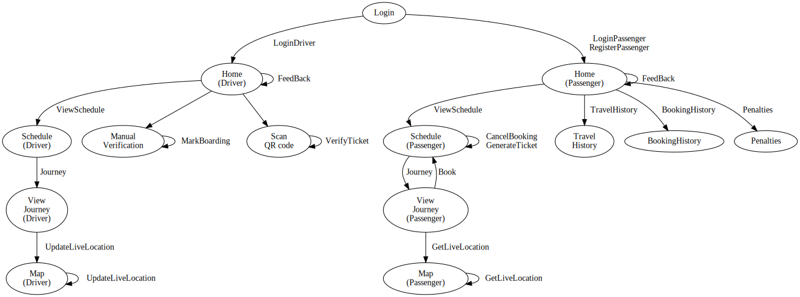

### Base Functions

##### Register Passsenger (authority)
```python
RegisterPassenger(email,password) -> {uid:int}
```

- emal is iitgn email
- password is same as google password
- verify the email password
- generate the UID
- adds entry to user table
- returns UID

##### Login Passenger (authority passenger)
```python
LoginPassenger(email,password) -> renders
```

- verify if email is registered
- if not registered, call  `RegisterPassenger`.
  - on fail. alert and redirect to same page
- check if correct password.
  - if not correct password, alert and redirect to same page
- Render a home page with the passenger object as the context.
  - links for passenger functionalities, except registering and booking (which will be done via the schedule page).
  - Personal details of the passenger, including user id, email id, image. (Refer members table).

##### Login Driver (authority driver)
```python
LoginDriver(uid,password) -> render
```

- TODO: add password to Driver table
- Render a home page with the driver object as the context.
  - links for driver functionalities, except updating live location, which will be done itself.
  - Personal details of the passenger, including driver id, mobile number, image. (Refer members table).

##### View Journey (passenger driver authority)
```python
Journey(jid:int) -> render
```

- gets the seat matrix (with boarding status for every seat) (for driver, also see user id)
- details of journey (same as in the schedule table)
- Have a form for booking a seat

##### Create Booking (passenger)
```python
Book(uid:int,jid:int,seat:int) -> render
```

- adds a booking
- renders the view schedule page

##### Cancel booking
```python
CancelBooking(BookingID) -> render
```
- get the user id
- update the database (atomic)
  - remove the booking
  - remove ticket (if generated)
- get the return code
- if successful, render view schedule page again
- else, redirect to same page.


##### View Schedule (authority passenger driver)
```python
ViewSchedule(uid:int) -> renders
```

- select * from schedule to give a dictionary with dates as keys
- from user's booking, change status of elements in dictionary at journey dates, and add links for
  - cancellation of a booking (only for passengers)
  - ticket generation (only for passengers)
  - drop down for details (frontend)
- Add links to view a particular journey for every date
- sort the dicionary
- convert to list
- render with the list and uid as context

Frontend task : Have bunch of filters
  - date : ascending, descending, range
  - only booked dates
  - dates related to a bus
  - dates related to a location
  - etc.

##### View Booking History (optional) (authority passenger)
```python
BookingHistory(uid:int) -> renders
```

- Envoke SQL procedure `GetUserBusUsage` and send table and uid as context

##### Travel History (authority passenger)
```python
TravelHistory(uid:int) -> renders
```

- Envoke SQL procedure and send table and uid as context

##### Feed back (passenger driver)
```python
FeedBack(uid:int) -> renders
```

- Takes in input from user and redirects to home page

##### Get Live Location (passenger and authority)
```python
GetLiveLocation(bid:int) -> render
```

renders map page with (bus object, latitude ,longitude) tuple as context

##### Update Live Location (driver and authority)
```python
UpdateLiveLocation(bid:int,lat:float,long:float) -> render
```

- updates the location in database
- renders map page with (bus object, latitude ,longitude) tuple as context


##### Penalty details (passenger and autority)
```python
Penalties(uid:int) -> render
```

##### Generate Ticket (passenger authority)
```python
GenerateTicket(bid:int) -> render
```

- get details of booking
- generate QR

##### Verify Ticket (driver)
```python
VerifyTicket(uid:int,qrimage:blob) -> redirects
```

- align qr
- decode it to get string $s$
- decode $s$ to get TicketID
- check if TicketID is in table
- if not there, alert
- if there mark-boarding-status

##### Mark boarding (driver)
```python
MarkBoarding(BookingID) -> renders
```

- verify booking
- add to log
- invokes mark boarding
- renders the done page

##### QR management
```python
EncodeQR(s:str) -> bitmap
DecodeQR(qr:bitmap) -> str
```

### Pages


