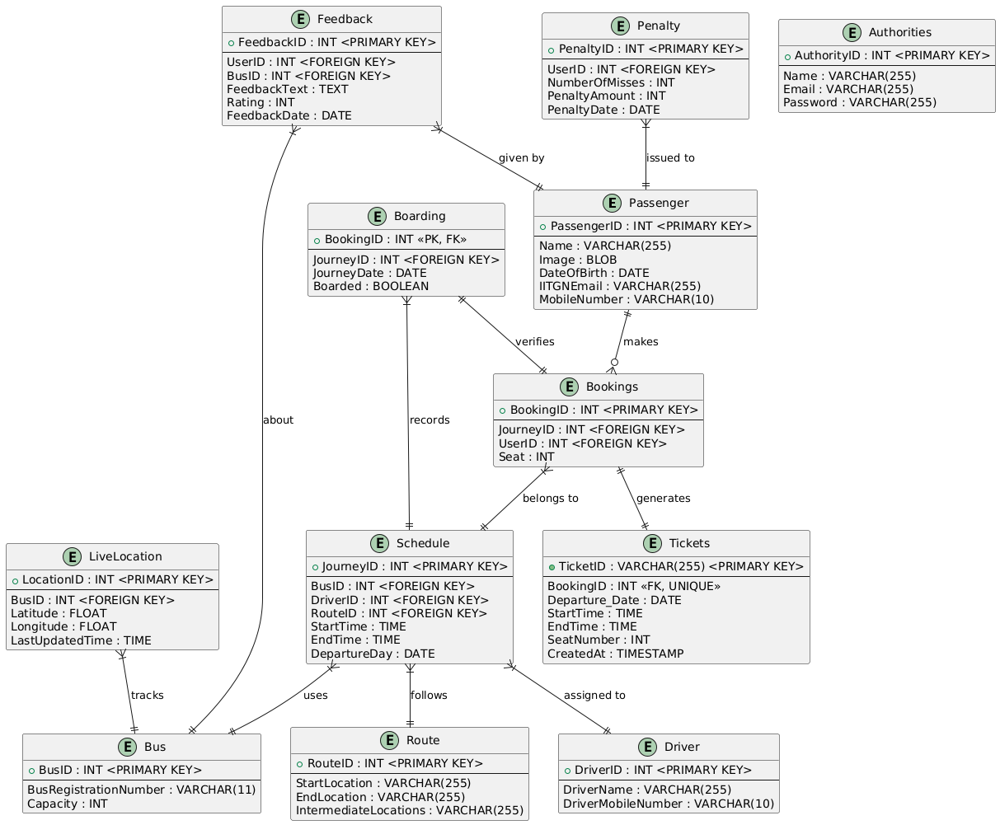

# Assignment 1 - ShuttleGo
_Aditya Mangla, Jaidev Sanjay Khalane, Pranav Joshi, Tapananshu Gandhi, Vannsh Jani_

## Directory structure
- The database is in the `submission.sql` SQL dump file.
- The images of contributors are in the `MemberPhotos` sub-directory.

## Functionalities
- [X] Our application will allow users to view the schedule of the buses for the next day.
- [X] To keep track of the buses (based on their registration numbers) as well as the contact numbers and details of their corresponding drivers.
- [X] Allow the users to create their profile (using IITGN email credentials).
- [X] Allow the user to book their rides for the current (or next) day in advance.
- [X] Allow the user to book only one ticket on a single bus.
- [X] Allow users to cancel their bookings up to three hours before their ride.
- [X] Allow the users to download their tickets for the buses (which may have some unique identifier).
- [X] Allow the bus driver/ conductor to verify the tickets of the people boarding the bus using that unique identifier.
- [X] Allow users to view the history of their travels in the last 30 days.
- [X] Allow the authorities to view the usage of buses by any of the users.
- [X] Allow the users to find the live location of the buses.
- [X] Allow the live location of the buses to be updated based on the coordinates obtained from sensor.
  
- [ ] Advanced parts to be implemented with Python Backend:
    1. Addition of a penalty mechanism where the users would be due a fine if they miss three bookings in an interval of 30 days.
    2. Addition of a dashboard corresponding to the usage of buses at different times for the authorities, which would enhance their awareness of the demands of buses at various times.
    3. Addition of Authentication using IITGN Email ID and the corresponding password.
    4. Uniqueness of the seat numbers and selection of seat numbers will also be incorporated with the frontend and Python backend.

## Database Overview

